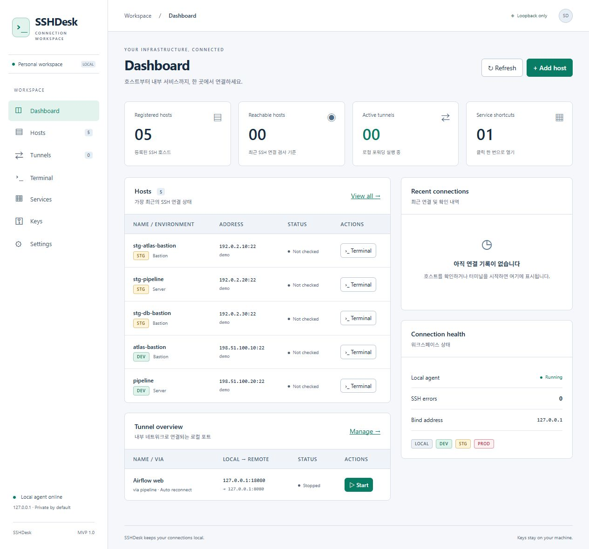
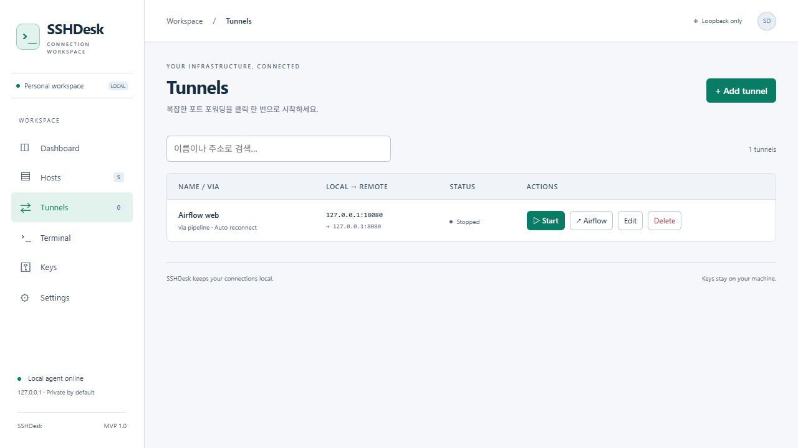
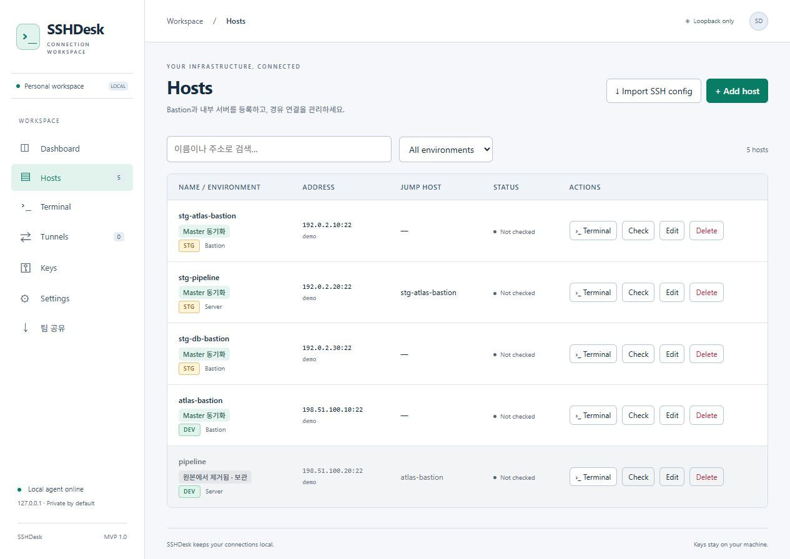
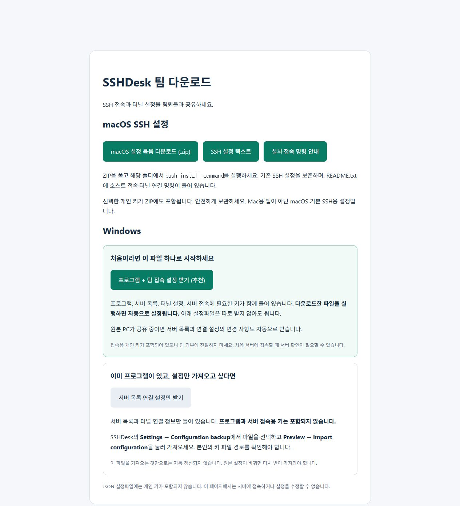

# SSHDesk

[](https://github.com/qmdch1/Gatedock/releases/latest/download/sshdesk.exe)

**[⬇ Windows용 sshdesk.exe 다운로드](https://github.com/qmdch1/Gatedock/releases/latest/download/sshdesk.exe)**

## 개요

내부망에서 개발하다 보면 서버 접속은 SSH 클라이언트에서, Bastion 경유와 포트 포워딩은 별도 명령어로, 내부 서비스 접속은 브라우저에서 처리하게 됩니다. 여러 도구를 오가며 접속 정보를 반복해서 설정하는 불편함을 줄이기 위해 SSHDesk를 만들었습니다.

SSHDesk는 Windows에서 SSH 접속, 다중 Bastion 경유, 터널, 내부 웹 서비스 바로가기를 한곳에서 관리하는 도구입니다. 실행파일 하나로 시작하고, 브라우저에서 서버를 등록하거나 터미널을 열고 필요한 서비스를 실행할 수 있습니다.

한 사람이 구성한 접속 환경을 팀원에게 공유할 수 있습니다. Windows 팀원은 키와 설정이 담긴 실행파일을, Mac 팀원은 SSH 설정 묶음을 받아 같은 호스트와 터널을 사용할 수 있습니다.

## 주요 기능

- **서버 관리** — 호스트와 SSH 키를 등록하고 환경별로 관리
- **Bastion / 다중 경유** — Jump Host를 연결해 내부 서버에 접근
- **웹 터미널** — 등록한 서버에 브라우저에서 SSH 접속
- **터널 관리** — 로컬 포트 포워딩 시작·중지 및 연결 끊김 시 자동 재연결
- **웹 바로가기** — Tunnels에서 필요한 연결을 시작하고 내부 웹 서비스를 열기
- **기존 SSH 설정 활용** — 실행 시 Windows SSH config의 새 호스트 자동 등록
- **설정파일 공유** — 연결 구성을 내보내 다른 PC나 팀원에게 전달

## 화면 미리보기

가상 데이터로 촬영한 화면입니다.



Tunnels에서 포트 연결과 웹 바로가기를 함께 관리합니다.



호스트별 접속 주소, 계정, Jump Host를 한눈에 확인합니다.



## 시작하기

### Windows 실행파일로 설정하기

1. [Windows용 sshdesk.exe 다운로드](https://github.com/qmdch1/Gatedock/releases/latest/download/sshdesk.exe) 후 실행합니다.
2. 자동으로 열리는 브라우저에서 관리 화면에 접속합니다. 직접 접속할 때는 <http://127.0.0.1:9876>을 사용합니다.
3. 기존 `%USERPROFILE%\.ssh\config`가 있으면 새 호스트와 키 경로를 자동으로 등록합니다. 직접 등록하려면 **Keys → Add key**, **Hosts → Add host**를 사용합니다.
4. 호스트의 **Terminal**로 접속하거나, **Tunnels → Add tunnel**에서 포트 연결을 등록합니다. 웹 서비스라면 선택 항목인 웹 바로가기 이름과 URL도 입력하세요.

개인 키는 파일 선택 또는 경로 입력으로 등록합니다. Bastion을 거치는 서버는 Host의 **Jump host**에 경유할 호스트를 지정하세요. 서버 확인에는 해당 PC의 `known_hosts` 또는 별도로 확인한 서버 지문을 사용합니다.

프로그램을 종료하면 SSH 연결과 터널도 종료됩니다. 설정은 `%LOCALAPPDATA%\SSHDesk\sshdesk.db`에 남으므로 실행파일을 교체하거나 다시 실행해도 유지됩니다.

## Docker로 간편하게 실행하기

**소스 다운로드나 빌드 없이, 설정파일 하나만 받으면 됩니다.** 게시된 이미지를 자동으로 내려받아 실행합니다.

Windows에서 키까지 포함해 팀원에게 전달하려면 위의 **Windows 실행파일** 방식이 가장 간단합니다. Docker를 사용하려면 아래 순서대로 진행하세요.

### 1. Docker 준비 — 최초 한 번

- **Linux:** Docker Engine과 Compose를 설치합니다.
- **Windows / Mac:** Docker Desktop을 실행하고 Linux 컨테이너 모드를 사용합니다. **host networking 설정은 필요 없습니다.** Compose가 관리 화면을 `127.0.0.1:9876`에 자동 연결합니다.

### 2. 빈 폴더에서 아래 명령 실행

**Windows PowerShell**

```powershell
curl.exe -fL https://raw.githubusercontent.com/qmdch1/Gatedock/main/compose.yaml -o compose.yaml
docker compose up -d
```

**Linux / Mac 터미널**

```sh
curl -fL https://raw.githubusercontent.com/qmdch1/Gatedock/main/compose.yaml -o compose.yaml
docker compose up -d
```

### 3. 브라우저 열기

**<http://127.0.0.1:9876>**

이미 Windows용 SSHDesk를 실행 중이라면 먼저 종료하세요. 프로그램은 백그라운드에서 실행되고, 저장한 설정은 같은 폴더에서 재실행·업데이트해도 유지됩니다.

**업데이트·다시 시작도 같은 명령 하나입니다.**

```sh
docker compose up -d
```

<details>
<summary>내 서버에 접속하기 — SSH 키와 설정 준비</summary>

프로그램 실행은 자동으로 준비되지만, 서버 접속용 키와 서버 정보는 본인이 넣어야 합니다.

1. 웹 화면의 **Keys → Add key → 파일 선택**에서 사용할 SSH 개인 키를 선택합니다.
2. 이름을 입력하고 **Save**를 누릅니다. Windows·Mac 브라우저 모두 사용할 수 있고, 키는 Docker의 영구 데이터 볼륨에 저장됩니다.
3. **Hosts → Add host**에서 서버 주소·계정과 등록한 키를 선택합니다.

직접 경로를 등록하려면 키를 `local/ssh`에 넣고 `/home/sshdesk/.ssh/키파일명`을 입력하세요. 기존 SSH `config`를 같은 폴더에 넣고 `docker compose restart`하면 새 호스트를 자동 등록합니다. `IdentityFile`은 `/home/sshdesk/.ssh/키파일명`으로 지정하세요. Windows의 `C:\...` 경로는 컨테이너에서 사용할 수 없습니다. 필요한 `known_hosts`도 같은 폴더에 넣을 수 있습니다.

이 폴더는 읽기 전용으로 연결되며 이미지에 포함되지 않습니다. Linux에서는 컨테이너 사용자 UID 1000이 키를 읽을 수 있어야 합니다. 다른 폴더를 쓰려면 실행 전 `SSH_KEY_DIR` 환경변수에 절대 경로를 지정하세요.

Docker에서도 브라우저 파일 선택을 지원합니다. 선택한 키는 Save 시 실행 환경의 보호된 `uploaded-keys` 폴더에 복사되며, 설정 내보내기나 공개 이미지에는 포함되지 않습니다. 키 포함 Windows 실행파일 배포는 Windows에서 지원합니다. 터널의 **Local port는 18080~18089** 중 하나를 사용하면 별도 포트 설정 없이 접속할 수 있습니다. 웹 페이지는 브라우저에 `http://127.0.0.1:설정한포트`를 입력해 여세요.

다른 포트가 필요하면 `compose.yaml`의 `ports`에 `"127.0.0.1:15432:15432"`처럼 추가하고 `docker compose up -d`를 실행하세요. 호스트 쪽 주소는 `127.0.0.1`로 유지합니다. 팀 다운로드용 9877 포트는 기본으로 공개하지 않습니다.

</details>

<details>
<summary>상태 확인·종료·데이터 보관</summary>

```sh
# 실행 상태 확인
docker compose ps

# 종료 — 저장된 설정은 유지
docker compose down
```

설정은 Docker 볼륨 `sshdesk-data`에 저장됩니다. Compose는 실행 폴더 이름을 앞에 붙여 볼륨을 구분하므로, 계속 같은 폴더에서 명령을 실행하세요. `local/ssh`의 키 파일도 보관하세요.

최신 이미지를 적용하면 컨테이너가 다시 만들어질 수 있으며, 실행 중인 SSH 연결과 터널은 종료됩니다. 저장된 설정은 유지됩니다.

</details>

<details>
<summary>클라우드 이미지 위치와 새 이미지 게시하기</summary>

이미지는 **GitHub Container Registry(GHCR)**의 `ghcr.io/qmdch1/gatedock:latest`에 게시되어 있습니다. 위의 Compose가 이 주소에서 이미지를 자동으로 받으므로 별도의 다운로드나 파일 수정은 필요 없습니다. 게시 이미지는 Linux amd64용입니다.

개발자가 새 버전을 게시할 때는 이 저장소의 **Actions → Publish container image → Run workflow**를 실행합니다. 프로그램만 빌드해 게시하며 SSH 키·개인 설정·DB는 포함하지 않습니다. [GitHub 공식 안내](https://docs.github.com/en/actions/tutorials/publish-packages/publish-docker-images)

클라우드 서버에서 실행할 때도 Compose가 관리 포트를 서버의 로컬 주소로만 연결합니다. 현재 사용자 로그인 기능이 없으므로 SSH 포워딩 등으로 접속하고 관리 포트를 인터넷에 공개하지 마세요. 이미지를 게시하는 것만으로 클라우드 서버가 생성되거나 웹 서비스가 실행되지는 않습니다.

</details>

## Windows에서 실행이 차단될 때

**Smart App Control이 SSHDesk 실행을 차단한 경우**, 해당 보호 기능을 끄려면 **PowerShell을 관리자 권한으로 실행**하고 아래 명령을 복사해 입력하세요.

```powershell
Set-ItemProperty -Path "HKLM:\SYSTEM\CurrentControlSet\Control\CI\Policy" -Name "VerifiedAndReputablePolicyState" -Value 0
```

> 이 명령은 SSHDesk만 허용하는 것이 아니라 PC 전체의 Smart App Control을 끄는 설정입니다. 일반적인 프로그램 오류 해결 명령이 아니며, Windows 버전이나 관리 정책에 따라 적용되지 않을 수 있습니다. 회사 관리 PC에서는 관리자에게 확인하세요. Microsoft는 레지스트리를 통한 변경을 테스트 용도로 안내합니다. [Microsoft 공식 안내](https://learn.microsoft.com/en-us/windows/apps/develop/smart-app-control/test-your-app-with-smart-app-control#configure-smart-app-control-by-using-the-registry)

## 팀원과 바로 시작하기

한 사람이 연결을 설정해두면 팀원은 다운로드해서 사용할 수 있습니다.

**공유하는 사람**

1. **팀 공유**에서 공유할 키를 선택합니다.
2. **선택한 키로 배포본 만들기 → 공유 시작**을 누릅니다.
3. 화면에 표시된 주소를 같은 로컬망의 팀원에게 전달합니다.

**받는 사람**

- **Windows:** 공유 주소 접속 → **프로그램 + 팀 접속 설정 받기 (추천)** → 실행. 키와 관련 호스트·터널이 자동 등록되고, 원본 PC의 추가·수정 사항도 30초마다 반영됩니다.
- **Mac:** 공유 주소 접속 → **macOS 설정 묶음 다운로드** → 압축 해제. 해당 폴더에서 `bash install.command`를 실행하고 `README.txt`의 접속 명령을 사용합니다.

개인이 만든 설정은 유지합니다. 공유받은 항목은 원본 기준으로 갱신하며, 원본에서 사라진 항목은 삭제하지 않고 회색 **원본에서 제거됨 · 보관** 표시로 남깁니다. 원본 PC의 공유와 받는 PC의 앱이 켜져 있어야 자동 갱신됩니다. 실행 중인 연결은 유지하고 다음 연결부터 변경 사항을 적용합니다.

기존 배포본 사용자는 새 팀 배포본을 한 번 받아 실행하세요. **팀 공유 → 내 PC의 원본 구독**에서 갱신을 일시 중지하거나 원본 IP 변경을 반영할 수 있습니다. 개인 키 추가·변경은 새 배포본이 필요합니다. Mac SSH 설정 묶음과 일반 JSON 가져오기는 자동 갱신하지 않으므로 변경 시 다시 받으세요.

처음 접속하는 서버의 지문은 확인이 필요할 수 있습니다. 키 포함 파일은 신뢰하는 팀원에게만 전달하고 공개 저장소에는 올리지 마세요.



<details>
<summary>팀원이 공유 주소에 접속하지 못한다면</summary>

공유 PC에서 앱과 **팀 공유**가 켜져 있는지 확인하세요. 주소는 `http://공유-PC-IP:9877`이며, WSL·VPN 주소 대신 팀원과 연결된 로컬망 주소를 사용합니다.

Windows 방화벽 허용은 최초 한 번 관리자 PowerShell에서 실행합니다.

```powershell
New-NetFirewallRule -Name "SSHDesk-Team-Downloads-9877" -DisplayName "SSHDesk Team Downloads (Local Subnet)" -Direction Inbound -Action Allow -Protocol TCP -LocalPort 9877 -RemoteAddress LocalSubnet -Profile Domain,Private,Public
```

회사 네트워크에서 장치 간 통신을 제한하면 네트워크 관리자에게 확인하세요. HTTP 공유이므로 신뢰하는 로컬망에서만 사용하세요.

</details>

<details>
<summary>개인 키 없이 설정파일만 공유하기</summary>

**Settings → Configuration backup → 내보내기**로 파일을 전달합니다. 팀원은 **설정파일 선택 → Preview → Import configuration**으로 가져온 뒤 본인의 키 경로와 계정을 지정합니다.

</details>

## 실행 옵션

```powershell
# 기본 실행
.\sshdesk.exe

# 브라우저 자동 열기 끄기
.\sshdesk.exe -no-browser

# 기존 SSH config 자동 등록 끄기
.\sshdesk.exe -no-auto-import

# 별도 포트와 데이터 위치 사용
.\sshdesk.exe -port 9880 -data-dir C:\SSHDesk-workspace
```

데이터 위치는 로컬 디스크의 절대 경로를 사용하세요. 같은 데이터 위치를 여러 실행 인스턴스에서 동시에 사용하지 마세요.

## 지원 범위

Windows를 우선 지원하며, 실행 시 별도의 SSH 클라이언트나 Node.js 설치가 필요하지 않습니다. 관리 화면과 터널은 로컬 PC에서만 접근할 수 있고, 명시적으로 켠 다운로드 페이지만 같은 로컬망에 공유됩니다.

현재 암호가 설정된 개인 키, SSH agent, 하드웨어 키, SSH 인증서, SFTP, 원격 포워딩 및 SOCKS는 지원하지 않습니다. SSH config의 일부 고급 설정도 지원하지 않으며 가져오기 화면에서 확인할 수 있습니다. 팀 공유는 선택한 키 범위의 설정 배포와 Windows 앱 간 자동 갱신을 지원하며, 중앙 계정·권한 관리 기능은 제공하지 않습니다.

## 소스에서 빌드하기

Go 버전과 의존성은 [go.mod](go.mod)를 참고하세요.

```powershell
go test ./...
go vet ./...
go build -o sshdesk.exe ./cmd/sshdesk
```

Windows 빌드 스크립트는 [scripts/build.ps1](scripts/build.ps1), 검증 결과는 [검증 기록](docs/verification.md)을 참고하세요.

## 오픈소스 라이선스

SSH, SQLite, WebSocket, 터미널에 사용한 라이브러리의 고지와 라이선스는 [THIRD_PARTY_NOTICES.md](THIRD_PARTY_NOTICES.md)와 [licenses](licenses)에 있습니다.
